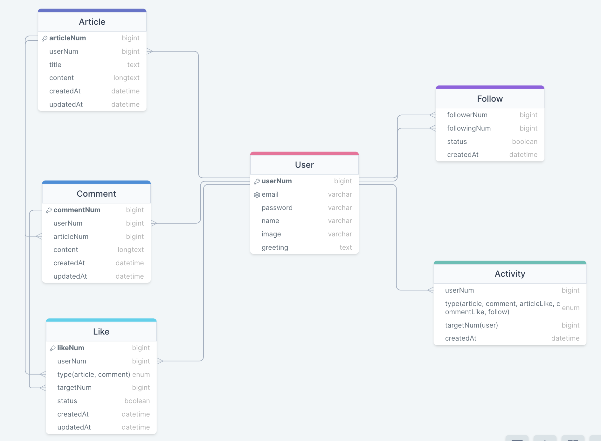

# 예약구매 서비스

## 목차
[1. 기능 소개](#기능-소개) 
[2. 프로젝트 설명](#프로젝트-설명) 
[3. 프로젝트 설치&실행방법](#프로젝트-설치--실행-방법)(미완성) 
[4. 유닛 테스트](#유닛-테스트)(미완성) 
[5. 문제 및 해결](#문제-및-해결)(미완성)

## 기능 소개

- **유저 관리**
    - [x] 이메일 인증을 통한 회원가입 기능
    - [x] jwt 토큰을 이용한 로그인 구현
    - [ ] 비밀번호는 암호화하고, 비밀번호 업데이트 시 모든 기기에서 로그아웃
- **팔로우 관계**
    - [x] 사용자가 다른 사용자와 팔로우 관계 형성 가능
- **포스트 및 뉴스피드:**
    - [x] 텍스트 기반의 포스트 작성
    - [x] 뉴스피드에 팔로우 관계인 유저들의 활동 표시
- **댓글 및 상호 작용:**
    - [x] 포스트에 댓글 작성 기능
    - [x] 포스트 및 댓글에 좋아요 기능

## 프로젝트 설명

### 개발 환경
- 사용언어 : `Java`
- 프레임워크 : `Spring`
- 데이터베이스 : `Mysql`, `redis`, `mongdb`
- ORM : `JPA`
- IDE : `IntelliJ`

### ERD

### API 명세서

| 기능         | Method | URL                 | Request | Response | Header |
|--------------|--------|---------------------|---------|----------|--------|
| 회원가입     | POST   | /api/user/signup    | `{ "email": "", "password": "", "name": "", "image": "", "greeting": "" }` | `{ "http status code": 201, "message": "회원가입 성공" }` | |
| 로그인       | POST   | /api/user/login     | `{ "email": "", "password": "" }` | `{ "http status code": 200, "jwt token": "" }` | |
| 로그아웃     | POST   | /api/user/logout    | `{ "email": "" }` | `{ "http status code": 200, "message": "로그아웃 성공" }` | `jwt token` |
| 유저 정보 조회 | GET    | /api/user/detail/{id} | | `{ "http status code": 200, "email": "사용자이메일", "name": "사용자이름", "image": "이미지URL", "greeting": "인사말" }` | `jwt token` |
| 유저 정보 수정 | PUT    | /api/user/detail/{id} | `{ "name": "", "image": "", "greeting": "" }` | `{ "http status code": 200, "message": "사용자 정보 수정 성공" }` | `jwt token` |
| 팔로우       | POST   | /api/follow          | `{ "email": "" }` | `{ "http status code": 200, "message": "팔로우 성공" }` | `jwt token` |
| 뉴스피드 조회 | GET    | /api/newsfeed        | | `{ "http status code": 200, "뉴스피드 데이터들..." }` | `jwt token` |
| 포스트 작성   | POST   | /api/post            | `{ "title": "", "text": "" }` | `{ "http status code": 201, "message": "글 작성 성공" }` | `jwt token` |
| 포스트 상세 조회 | GET    | /api/post/{id}       | | `{ "http status code": 200, "title": "글 제목", "text": "글 내용", "comments": "댓글들..." }` | `jwt token` |
| 댓글 작성     | POST   | /api/comment/{id}    | `{ "text": "" }` | `{ "http status code": 201, "message": "댓글 작성 성공" }` | `jwt token` |
| 포스트 좋아요 | POST   | /api/like/post/{id}  | | `{ "http status code": 200, "message": "포스트 좋아요 성공" }` | `jwt token` |
| 댓글 좋아요   | POST   | /api/like/comment/{id} | | `{ "http status code": 200, "message": "댓글 좋아요 성공" }` | `jwt token` |
